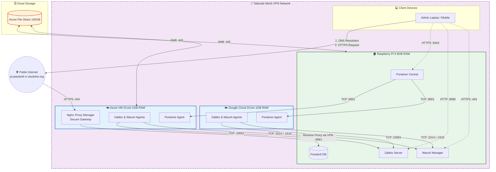

# Hybrid Infrastructure Homelab Project

Profesjonalne laboratorium inżynierskie oparte na architekturze hybrydowej, łączące zasoby on-premise (Raspberry Pi 5) z chmurą publiczną (Azure, GCP). Projekt służy do symulacji, wdrażania i testowania rozwiązań klasy enterprise w skalowalnym i bezpiecznym środowisku.

## 👨‍💻 O mnie

Jestem studentem ostatniego semestru Informatyki i Młodszym Administratorem Systemów. Moja pasja to budowanie bezpiecznej i skalowalnej infrastruktury IT. Ten projekt jest moim poligonem doświadczalnym, gdzie teorię zamieniam na praktyczne wdrożenia rozwiązań, z którymi stykam się w środowiskach komercyjnych.

---

## 🏗️ Architektura i Komunikacja

Infrastruktura działa w modelu hybrydowym. Centralny punkt zarządzania i przechowywania danych znajduje się on-premise (RPi5), natomiast usługi wystawione na świat (frontend) lub pomocnicze zostały wyniesione do chmury publicznej w celu zwiększenia bezpieczeństwa i separacji ruchu.

**Kluczowe elementy komunikacji:**

* **Tailscale Mesh VPN:** Wszystkie węzły (RPi, Azure VM, GCP VM) są połączone prywatną, szyfrowaną siecią mesh. Umożliwia to bezpieczną komunikację międzyusługową (np. agent Zabbixa z Azure do serwera na RPi) bez wystawiania portów do publicznego internetu.
* **Secure Gateway (Azure):** Maszyna wirtualna Azure pełni rolę bezpiecznej bramy wejściowej. Działa tam Nginx Proxy Manager, który przyjmuje ruch publiczny (HTTP/HTTPS) i bezpiecznym tunelem Tailscale przekierowuje go do usług wewnętrznych na RPi (np. Passbolt).

### 🛡️ Omówienie Architektury Hybrydowej

Zaprojektowana przeze mnie infrastruktura opiera się na zasadzie Zero-Trust i ścisłej separacji usług:

* **Zarządzanie Flotą Kontenerów:** Serce systemu stanowi `Portainer CE` działający na Raspberry Pi, który poprzez bezpieczne połączenie (port 9001) zarządza agentami na instancjach chmurowych (Azure, GCP). Umożliwia to wdrażanie stacków na dowolnym węźle z jednego, centralnego panelu.
* **Obserwowalność i Bezpieczeństwo (Observability & Security):** Na każdym węźle w chmurze działają zoptymalizowane agenty przesyłające dane telemetryczne do serwera `Zabbix` (port 10051) oraz logi bezpieczeństwa do menedżera `Wazuh SIEM` (porty 1514/1515). Pozwala to na błyskawiczne reagowanie na anomalie.
* **Bezpieczna Komunikacja (Mesh VPN):** Żadna usługa wewnętrzna (w tym bazy danych czy panele zarządzania) nie jest wystawiona bezpośrednio do publicznego internetu. Cały ruch między chmurami a serwerownią domową odbywa się przez szyfrowaną sieć `Tailscale`.
* **Skalowalny Storage:** Zamiast obciążać ograniczony dysk lokalny lub tworzyć drogie dyski maszyn wirtualnych, podpiąłem zewnętrzny udział plikowy Azure File Share (SMB, port 445), który służy węzłom jako wspólne repozytorium na backupy (np. zrzuty bazy Passbolta).
