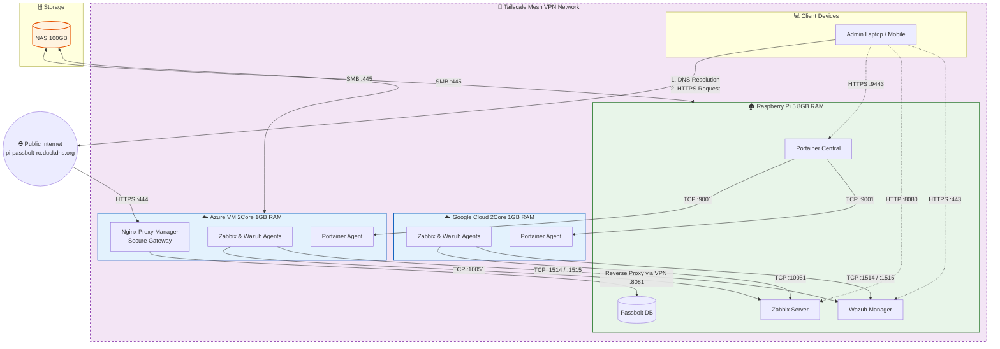

# 🛡️ RPi5-Homelab: Hybrid Infrastructure Homelab Project
> **High-availability internal infrastructure project based on Raspberry Pi 5.**


---

Profesjonalne laboratorium inżynierskie oparte na architekturze hybrydowej, łączące zasoby on-premise (Raspberry Pi 5) z chmurą publiczną (Azure, GCP). Projekt służy do symulacji, wdrażania i testowania rozwiązań klasy enterprise w skalowalnym i bezpiecznym środowisku.

## 👨‍💻 O mnie

Jestem studentem ostatniego semestru Informatyki i pracującym Junior System Administratorem. Moja pasja to budowanie bezpiecznej i zautomatyzowanej infrastruktury IT. Ten projekt to mój poligon doświadczalny, gdzie wiedzę akademicką zamieniam na praktyczne wdrożenia technologii używanych w nowoczesnych środowiskach komercyjnych.

## 🛠️ Tech Stack

* **Infrastruktura & Chmura:** Raspberry Pi 5 (On-Premise), Microsoft Azure (VM, File Share), Google Cloud Platform (Compute Engine)
* **Wirtualizacja & Orkiestracja:** Docker, Docker Compose, Portainer CE (Zarządzanie flotą)
* **Sieci & Bezpieczeństwo:** Tailscale (Mesh VPN), Nginx Proxy Manager (Reverse Proxy), Wazuh SIEM, Passbolt
* **Obserwowalność (Observability):** Zabbix (Server & Agents)

---

## 🏗️ Architektura i Komunikacja

Poniższy diagram przedstawia przepływ ruchu sieciowego oraz logiczną separację warstw w modelu hybrydowym.


```mermaid
graph TD
    %% Definicje stylów dla lepszej czytelności
    classDef cloud fill:#e3f2fd,stroke:#1565c0,stroke-width:2px;
    classDef onprem fill:#e8f5e9,stroke:#2e7d32,stroke-width:2px;
    classDef vpn fill:#f3e5f5,stroke:#7b1fa2,stroke-width:2px,stroke-dasharray: 5 5;
    classDef storage fill:#fff3e0,stroke:#e65100,stroke-width:2px;

    Internet((🌐 Public Internet\npi-passbolt-rc.duckdns.org))

    subgraph Tailscale[🔐 Tailscale Mesh VPN Network]
        direction TB

        subgraph Clients[💻 Client Devices]
            Admin[Admin Laptop / Mobile]
        end

        subgraph Azure[☁️ Azure VM 2Core 1GB RAM]
            NPM[Nginx Proxy Manager\nSecure Gateway]
            AzAgents[Zabbix & Wazuh Agents]
            AzPA[Portainer Agent]
        end

        subgraph GCP[☁️ Google Cloud 2Core 1GB RAM]
            GCPAgents[Zabbix & Wazuh Agents]
            GCPPA[Portainer Agent]
        end

        subgraph Local[🏠 Raspberry Pi 5 8GB RAM]
            Portainer[Portainer Central]
            Passbolt[(Passbolt DB)]
            Zabbix[Zabbix Server]
            Wazuh[Wazuh Manager]
        end
    end

    subgraph NAS[🗄️  Storage]
        SMB[(NAS 100GB)]
    end

    %% Ruch użytkownika do Passbolta (Zewnętrzny)
    Admin -- "1. DNS Resolution\n2. HTTPS Request" --> Internet
    Internet -->|HTTPS :444| NPM

    %% Ruch wewnętrzny przez Proxy
    NPM -->|Reverse Proxy via VPN :8081| Passbolt

    %% Dostęp administracyjny (Wewnętrzny VPN)
    Admin -.->|HTTPS :9443| Portainer
    Admin -.->|HTTP :8080| Zabbix
    Admin -.->|HTTPS :443| Wazuh

    %% Centralne zarządzanie Portainerem
    Portainer -->|TCP :9001| AzPA
    Portainer -->|TCP :9001| GCPPA

    %% Przepływ logów i telemetrii
    AzAgents -->|TCP :10051| Zabbix
    AzAgents -->|TCP :1514 / :1515| Wazuh
    GCPAgents -->|TCP :10051| Zabbix
    GCPAgents -->|TCP :1514 / :1515| Wazuh

    %% Montowanie dysków sieciowych
    SMB <-->|SMB :445| Local
    SMB <-->|SMB :445| Azure

    %% Aplikacja stylów
    class Azure,GCP cloud;
    class Local onprem;
    class Tailscale vpn;
    class SMB storage;
```

<br>

***


<details>
<summary>
    
### 🛡️ Bezpieczne SSH

</summary>

<br>


> Bezpiecześtwo jest na pierwszym miejscu, postanowiłem zabezpieczyć moją Malinkę o nastepującę parametry:

<br> 

### 🛡️ Key Implementations:
* **Kryptografia Asymetryczna:** Całkowita rezygnacja z haseł na rzecz par kluczy **Ed25519** (krzywe eliptyczne).
* **Identity Verification:** Dostęp do powłoki systemu ograniczony wyłącznie do autoryzowanych hostów (Windows/Fedora) z aktywnym kluczem prywatnym.
* **Root Access Policy:** Implementacja `PermitRootLogin no` – wymuszenie eskalacji uprawnień poprzez `sudo`.
* **SSH Configuration:** Optymalizacja parametru `MaxAuthTries 5` oraz wyłączenie `PasswordAuthentication`.
* **Fail2Ban:**: Zastosowanie prostego IPS (Intrusion Prevention System) w celu banowania adresu IP po wykryciu Brute Force
---


<details>
<summary>🔒🛡️ Dowód 1: Wyłączone Uwierzytelnianie Hasłem (Passwordless Auth)</summary>
<br>

Próba połączenia z nowej stacji roboczej (Fedora), która nie posiada jeszcze autoryzowanego klucza. Zwróć uwagę, że serwer **nie prosi o hasło**, lecz natychmiast odrzuca sesję, informując o braku klucza publicznego.

```bash
keinshur@fedora:~$ ssh pi@192.168.8.178
The authenticity of host '192.168.8.178 (192.168.8.178)' can't be established.
ED25519 key fingerprint is SHA256:rpT36czV+9WAerc4a9j4IYtyhIki3TTXYT8Ds8I/pvE.
Are you sure you want to continue connecting (yes/no)? yes
Warning: Permanently added '192.168.8.178' (ED25519) to the list of known hosts.
pi@192.168.8.178: Permission denied (publickey).
```
</details>


***


<details>
<summary>🚫 Dowód 2: Zablokowane Logowanie Direct-Root</summary>
<br>

Nawet przy próbie logowania na konto administracyjne root, serwer odrzuca połączenie na poziomie protokołu SSH. Wymusza to na administratorze zalogowanie się jako standardowy użytkownik i eskalację uprawnień przez sudo.

```PowerShell
PS C:\Users\rafcie> ssh root@192.168.8.178
root@192.168.8.178: Permission denied (publickey).
```

</details>


***


<details>
<summary>✅ Dowód 3: Autoryzowany dostęp (Klucz + Passphrase)</summary>
<br>

Prawidłowy proces logowania z głównej stacji Windows. Zwróć uwagę na wymóg podania Passphrase do klucza prywatnego – to dodatkowa warstwa zabezpieczeń (2FA) na wypadek kradzieży fizycznego urządzenia.

```PowerShell
PS C:\Users\rafcie> ssh pi@192.168.8.178
Enter passphrase for key 'C:\Users\rafcie/.ssh/id_ed25519':
Linux pi 6.12.62+rpt-rpi-2712 #1 SMP PREEMPT Debian 1:6.12.62-1+rpt1~bookworm (2026-01-19) aarch64

Last login: Mon Mar  9 18:48:41 2026 from 100.72.53.112
pi@pi:~ $
```
Nawet przejęcie kontroli nad siecią lokalną nie pozwala na nieautoryzowany dostęp bez posiadania unikalnego klucza i znajomości hasła do jego odszyfrowania.
</details>


***


<details>
<summary>🛡️ Phase 4: Active Incident Response & Monitoring (IPS)</summary>
<br>

 ***
 
> W tej fazie projekt przeszedł z pasywnej ochrony (hardening) do aktywnej obrony. Zaimplementowano system **IPS (Intrusion Prevention System)**, który w czasie rzeczywistym analizuje próby naruszenia bezpieczeństwa i podejmuje autonomiczne działania obronne.

***
<details>
<summary>⚙️ Kluczowe parametry systemu oraz konfiguracja strażnika </summary>
<br>
 
* **Silnik detekcji:** Fail2Ban zintegrowany bezpośrednio z szyną zdarzeń `systemd`.
* **Polityka agresywności:** Tryb `mode = extra` — monitorowanie nie tylko błędnych haseł, ale i odrzuconych prób negocjacji kluczy publicznych (preauth).
* **Threshold (Próg):** Limit **5 nieudanych prób** w określonym czasie skutkuje natychmiastową blokadą adresu IP na firewallu.
* **Integracja SMTP:** Wykorzystanie `msmtp` do przesyłania raportów o incydentach (Real-time Alerting).

## 📄 Konfiguracja Strażnika (`/etc/fail2ban/jail.local`):
```ini
[sshd]
enabled  = true
port     = ssh
backend  = systemd
mode     = extra
maxretry = 5
bantime  = 1h
ignoreip = 127.0.0.1/8 ::1 192.168.8.176  # Biała lista administratora
action   = %(action_mwl)s[lines=20]       # Ban + Mail z raportem WHOIS i logami
```
</details>

***


<details>
<summary>🔍 Audit: Dowody aktywnej obrony (Real-time Logs)</summary>


<br>

Poniżej prezentuję działanie Fail2Ban oraz powidomień SMTP

<br>

🛡️ Dowód 1: Wykrycie ataku i nałożenie blokady (Fail2Ban Log)
Wycinek z /var/log/fail2ban.log pokazujący proces zliczania prób i finalny ban dla hosta 192.168.8.186

<br>

```Plaintext
2026-03-09 20:11:16,792 fail2ban.filter : INFO [sshd] Found 192.168.8.186
2026-03-09 20:11:18,034 fail2ban.filter : INFO [sshd] Found 192.168.8.186
2026-03-09 20:11:19,386 fail2ban.actions: NOTICE [sshd] Ban 192.168.8.186
```
<br>

📩 Dowód 2: Skuteczna wysyłka alertu przez bramkę SMTP
Logi z usługi msmtp potwierdzające, że serwer Gmail przyjął i przetworzył powiadomienie o incydencie (Status 250 OK).

```Plaintext
Mar 09 20:11:21 host=smtp.gmail.com tls=on auth=on user=rafal.ciereszko.2abt@gmail.com 
recipients=rafal.important.information@gmail.com mailsize=3241 
smtpstatus=250 smtpmsg='250 2.0.0 OK 1773083481 ... - gsmtp' exitcode=EX_OK
```
Połączenie narzędzi Fail2Ban oraz msmtp tworzy niezawodną pętlę sprzężenia zwrotnego. Administrator jest informowany o ataku w ciągu < 3 sekund od jego wystąpienia, co skraca czas reakcji na incydent do minimum.


</details>

</details>


</details>

***
<details>
<summary>

### 🔍2 Inwentarz Węzłów oraz Pełna Mapa Portów i Usług
</summary>
<br>


### 📋 Inwentarz Węzłów (Nodes)

| Hostname | Lokalizacja | OS | Rola w systemie |
| :--- | :--- | :--- | :--- |
| **RPi5-Homelab** | Dom (Białystok) | Debian | Central Management, SIEM, Monitoring |
| **Fedora-Node** | Laptop (Local) | Fedora | App Node, Workstation, Podman Runtime |
| **Azure-VM** | Chmura (Azure) | Linux | Reverse Proxy (NPM), Cloud Storage |
| **GCP-Node** | Chmura (GCP) | Linux | Backup Node, External Health-Check |

### 🔍 Pełna Mapa Portów i Usług (Service Blueprint)
Inwentaryzacja usług na podstawie aktywnego nasłuchu procesów (netstat).

| Port | Usługa / Proces | Warstwa | Zastosowanie |
| :--- | :--- | :--- | :--- |
| **3000** | Grafana | Obserwowalność | Centralne dashboardy i wizualizacja danych. |
| **9090** | Prometheus | Obserwowalność | Baza danych metryk (Time-series database). |
| **9100** | Node Exporter | Obserwowalność | Metryki sprzętowe hosta dla Prometheusa. |
| **3100** | Loki | Obserwowalność | Agregacja i przeszukiwanie logów systemowych. |
| **8080 / 10051** | Zabbix Web/Server | Obserwowalność | Monitoring dostępności i wydajności maszyn. |
| **10050** | Zabbix Agent | Obserwowalność | Lokalny monitoring zasobów RPi5. |
| **8000 / 9200** | Wazuh UI / Indexer | Bezpieczeństwo | Panel SIEM oraz silnik indeksowania zdarzeń. |
| **1514 / 1515** | Wazuh Manager | Bezpieczeństwo | Komunikacja i rejestracja agentów SIEM. |
| **55000** | Wazuh API | Bezpieczeństwo | API do zarządzania infrastrukturą bezpieczeństwa. |
| **8081** | Passbolt | Bezpieczeństwo | Menedżer haseł klasy enterprise (szyfrowanie GPG). |
| **514 / UDP** | Syslog Server | Bezpieczeństwo | Odbieranie logów z urządzeń sieciowych. |
| **3001 / 2222** | Gitea (HTTP/SSH) | DevOps | Prywatne repozytoria kodu (Self-hosted Git). |
| **443** | Nginx Proxy Manager | Sieć | Publiczna brama (Gateway) z obsługą SSL. |
| **8083 / 8084** | NPM Admin / UI | Sieć | Panele administracyjne infrastruktury Reverse Proxy. |
| **9443** | Portainer (HTTPS) | Zarządzanie | Graficzne zarządzanie flotą kontenerów Docker. |
| **8082** | Filebrowser | Pliki | Webowy dostęp do systemu plików Homelaba. |
| **22** | OpenSSH | Dostęp | Dostęp terminalowy (Hardened SSH). |
| **5900** | WayVNC | Dostęp | Zdalny pulpit środowiska graficznego. |
| **41641 / UDP** | Tailscale | Sieć | Komunikacja w prywatnej sieci Mesh VPN. |
| **51820 / UDP** | WireGuard | Sieć | Zapasowy tunel VPN dla dostępu z zewnątrz. |
| **5353 / UDP** | Avahi (mDNS) | Sieć | Rozwiązywanie lokalnych nazw hostów w podsieci. |
| **7575** | Bazarr | Media | Zarządzanie napisami do multimediów. |
| **3002** | Custom Dashboard | Zarządzanie | Lekki dashboard startowy dla użytkownika. |

</details>

***
### Kolejny rozdział 

***
